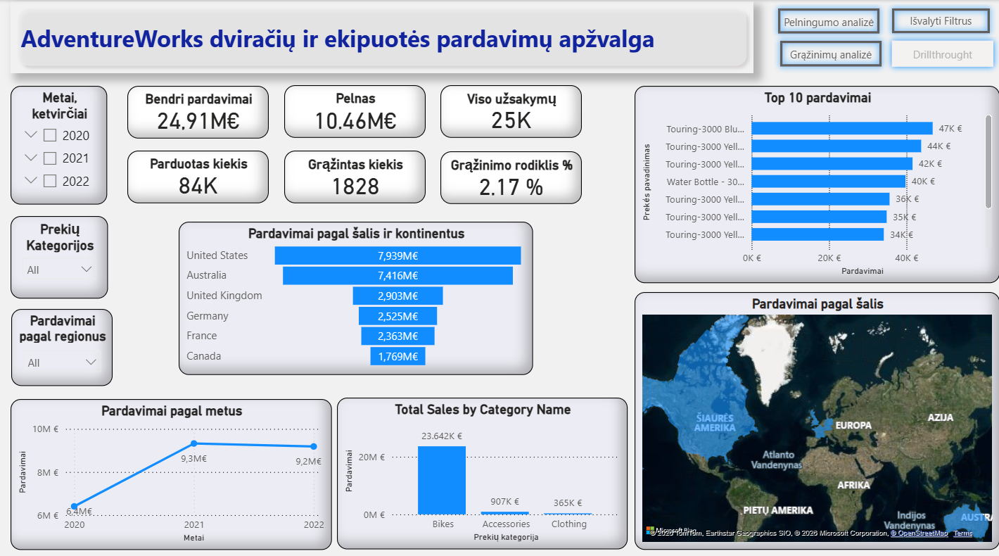
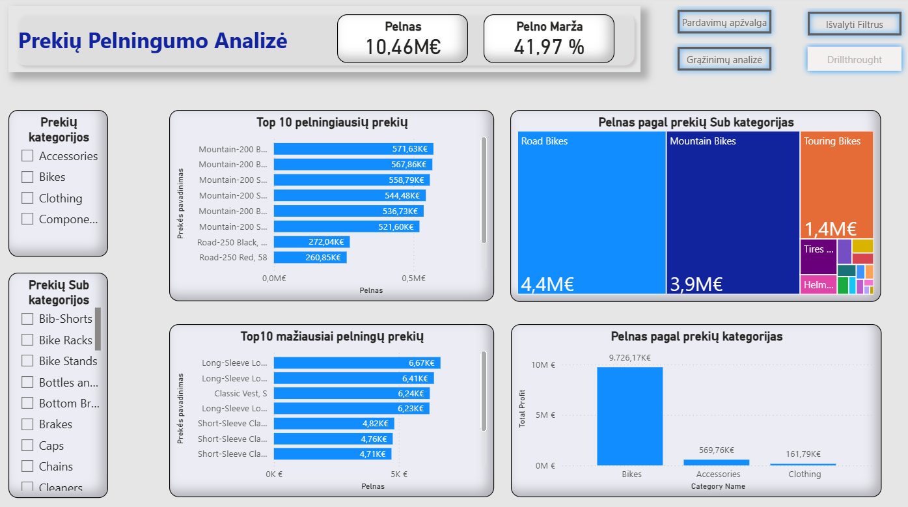
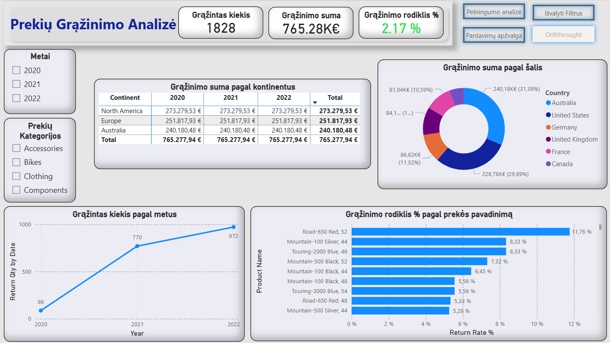

 📊 Power BI Sales and Returns Analysis Dashboard

 🔍 Project Overview
This project is an end-to-end Power BI business intelligence solution analyzing sales performance, profitability, customer behavior, and product returns for the years 2020–2022.

The goal of the project was to transform raw transactional data into actionable business insights using proper data modeling, DAX measures, and interactive dashboards suitable for business decision-making.

 🗂 Data Model
The data model follows a star schema design:

**Fact tables:**
- Fact_Sales
- Fact_Returns

**Dimension tables:**
- Date
- Products
- Customers
- Territory

Relationships are single-directional with inactive relationships activated using `USERELATIONSHIP()` where required (for returns date analysis).

📈 Key KPIs
- **Total Sales:** 24.91M €
- **Total Profit:** 10.46M €
- **Total Quantity Sold:** 84K units
- **Return Rate:** 2.17 %
KPIs are dynamically filtered by product, category, territory, and time.

 📊 Report Pages

 🔹 Sales Overview
High-level business performance view with:
- KPI cards
- Sales by category and year
- Monthly sales trend

 🔹 Product Analysis (Drillthrough Enabled)
Detailed product-level analysis:
- Sales vs Profit comparison
- Product contribution to revenue
- Drillthrough from overview to selected product

 🔹 Profitability Analysis
Focus on business efficiency:
- Profit by category and subcategory
- Identification of low-margin and high-margin products

 🔹 Returns Analysis
Evaluation of product return impact:
- Return quantity and rate by product and category
- Analysis of return behavior over time

 🛠 Tools & Skills Demonstrated
- Power BI Desktop
- Data modeling (star schema)
- Power Query data transformation
- DAX measures:
  - CALCULATE
  - DIVIDE
  - USERELATIONSHIP
  - Time intelligence calculations
- Drillthrough pages
- KPI indicators with conditional formatting
- Interactive filters and bookmarks

 

 🎯 Key Business Insights

- Overall sales increased significantly from 6.40M € in 2020 to 9.32M € in 2021, and remained stable in 2022 at 9.19M €, indicating sustainable business growth after rapid expansion.

- While Bikes sales slightly declined in 2022, other product categories continued to grow, suggesting diversification of revenue streams and reduced dependency on a single category.

- Bikes is the dominant product category, generating 23.64M € of total sales during 2020–2022, which represents the majority of company revenue.

- Within the Bikes category, Mountain Bikes and Road Bikes are the main revenue drivers due to high unit prices and strong sales volumes.

- In terms of absolute profit, Bikes also leads, as high sales volumes compensate for higher production costs.

- Accessories and Clothing categories show lower sales volume but stronger profit margins, with Accessories achieving an especially high margin of 62.84%, making them highly efficient contributors to profitability.

- Geographically, the largest share of sales and profit comes from the United States and Australia, while the United Kingdom dominates within Europe.

- Overall return rates are not systemic at category level and remain around 2.17%, indicating controlled operational risk.

- However, individual products show critical return levels above 4%, exceeding acceptable thresholds for the Bikes category.  
  For example, the product Road-650 Red had the highest return rate in 2021 and was discontinued in 2022, indicating responsive product management.

- In 2022, Touring-2000 Blue (model 46) remains in the highest risk group for returns and should be prioritized for quality or design review.

- By country, Germany has the highest return rate at 3.55%, while Canada has the lowest at 2.56%, suggesting potential differences in customer expectations or logistics quality.

- **Recommendation:** Given strong sales and profit performance (24.91M € total sales and 10.46M € profit), the primary optimization opportunity lies in reducing product returns, which requires deeper product-level and regional root-cause analysis.

KPIs are dynamically filtered by product, category, territory, and time.

📥 How to Open the Report
Download the `.pbix` file from this repository and open it using **Power BI Desktop**.
File:
- `Baigiamasis darbas galutinė versija.pbix`
  
## 👤 Author
Ricardas Berzinis  
Power BI / Data Analytics Junior Portfolio Project
